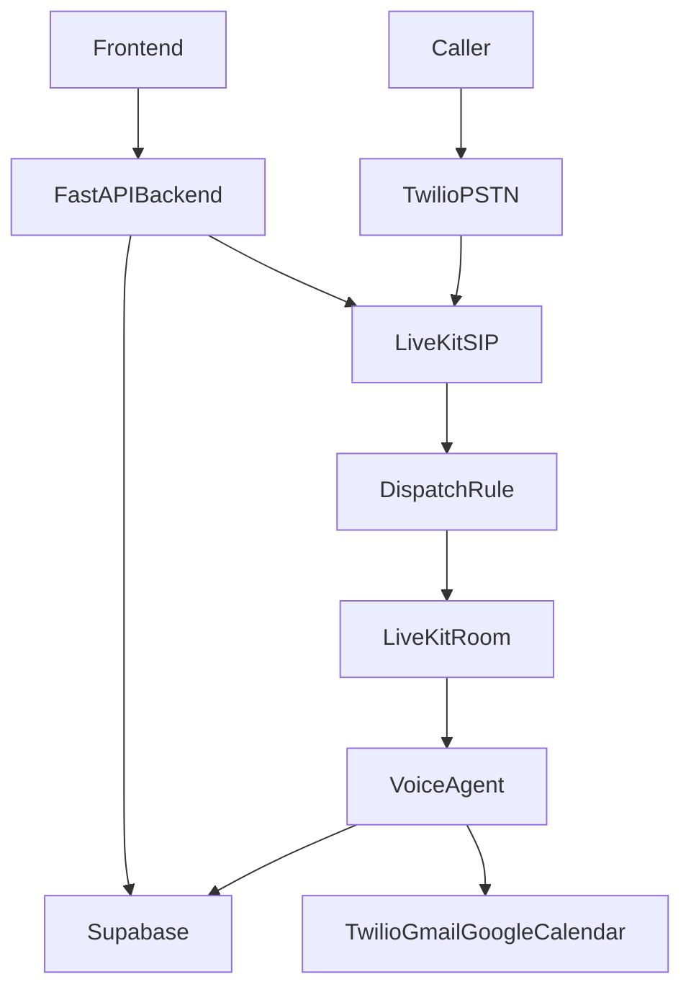
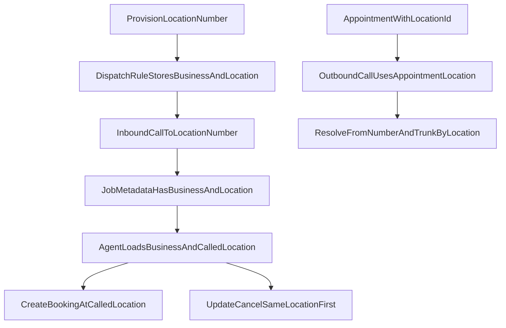

# Location-Scoped Phone Number And Agent Context Plan

> **Audience:** Developers implementing the location-scoped phone number model and the updated voice-agent behavior.
> **Status:** Draft implementation plan
> **Last updated:** 2026-04-08

---

## Implementation Plan Reference

When implementation begins, use the saved execution plan together with this design document:

- Plan file: [/home/lap-68/.cursor/plans/location-phone-scope_6269eea0.plan.md](/home/lap-68/.cursor/plans/location-phone-scope_6269eea0.plan.md)

Recommended usage:

1. Read this document first for architecture, behavior rules, and target flows.
2. Read the saved plan file for the concrete implementation sequence and task breakdown.
3. Implement against both documents together so behavior decisions and execution steps stay aligned.

---

## 1. Purpose

This document defines:

- the **current architecture** for inbound/outbound calling, phone-number provisioning, and agent context resolution
- the **current behavioral gaps** between the existing implementation and the desired location-based model
- the **target architecture and flow rules** for:
  - location-owned phone numbers
  - inbound call context
  - outbound call routing
  - agent prompt composition
  - appointment creation, updating, and cancellation

The goal is to move from an **effectively business-scoped phone/runtime model** to a **business-owned, location-anchored call model**.

---

## 2. Terminology

To avoid ambiguity, this document uses the following terms:

- **Business-wide shared context**
  - Company-level information the agent should always know:
  - business name
  - global settings
  - brand voice
  - shared policies
  - shared knowledge base
  - shared services, if services are not location-specific

- **Called-location primary context**
  - The specific branch/location associated with the called phone number:
  - location identity
  - location phone/address
  - location hours
  - location staff
  - location-owned AI number

- **Cross-location fallback**
  - Used only when a call is already anchored to one location but the caller needs help with another branch.
  - This should be allowed selectively, not as the default starting behavior.

---

## 3. Current Architecture

### 3.1 System model today

The system is already multi-tenant at the **business** level:

- each business is a tenant
- each business can have multiple locations
- each business can have multiple staff
- each business can have multiple provisioned AI phone numbers

The current runtime behavior, however, is still mostly **business-first**:

- `business_phone_numbers` stores both `business_id` and `location_id`
- phone number provisioning can attach a number to a location
- web calls can carry `location_id`
- appointment booking can store `location_id`
- but the active inbound/outbound runtime still behaves mostly like a **business-scoped call context with some location-aware behavior layered on top**

### 3.2 Current high-level flow

### 3.3 Current provisioning model

Today, provisioning already stores a location in the database row:

- `business_phone_numbers.business_id`
- `business_phone_numbers.location_id`
- `business_phone_numbers.phone_number`
- LiveKit inbound/outbound trunk IDs
- dispatch rule ID

But the dispatch rule implementation currently stores only:

- `business_id`

not:

- `location_id`

That means the number row is location-aware, but the primary inbound SIP metadata path is not fully location-aware in runtime behavior.

### 3.4 Current inbound call context

For inbound SIP calls, the agent currently tries to resolve context in this order:

1. `ctx.job.metadata`
2. `participant.metadata`
3. SIP participant attributes
4. database lookup by called number

Current issue:

- SIP dispatch metadata commonly resolves `business_id`
- but `location_id` is often not available through the normal inbound path
- when `location_id` is missing, the prompt builder falls back to the first location in the business

That means the current system can behave like:

- "call belongs to this business"
- "agent knows all locations"
- "agent may greet using first location if exact location is not resolved"

instead of:

- "call belongs to this exact location"

### 3.5 Current prompt composition

The agent currently builds a business-wide prompt containing:

- business details
- global settings
- business hours
- services
- brand voice
- all business locations and staff
- knowledge base

Then it optionally applies `location_id` to the greeting/location phrase.

Current issue:

- the prompt contains the whole business context
- the active location is not always authoritative
- the system still behaves like a business-wide receptionist that can discuss multiple locations

### 3.6 Current appointment behavior

#### Creation

Current state:

- the prompt tells the agent to ask which location the caller prefers if the business has multiple locations
- the booking tool accepts `location_name`
- the created appointment row stores that selected location's `location_id`

This means creation is already **location-capable**, but it still starts from a business-wide conversation model.

#### Update and cancellation

Current state:

- `find_appointments`, `update_appointment`, and `cancel_appointment` search by `business_id`
- they are not restricted to the called location by default
- the appointment row may include `location_id`, and the agent can read that back in responses
- but search scope remains business-wide

This means update/cancel are currently:

- **business-wide appointment operations**
- not **location-first appointment operations**

### 3.7 Current outbound behavior

Outbound calls are currently intended to:

- create a room
- dispatch the agent
- choose a business number/outbound trunk
- dial the customer through LiveKit SIP

Current issue:

- the backend outbound lookup is still effectively business-scoped
- it does not cleanly select the number by `location_id`
- it does not yet implement the desired "appointment location decides caller ID" behavior

### 3.8 Current frontend behavior

Frontend behavior is also mixed:

- onboarding already provisions a number for a specific location
- phone-number management still displays a business-wide flat list
- outbound flows are inconsistent:
  - some paths let a user choose a number
  - some paths rely on backend default resolution

So the UI currently does not fully reinforce the intended one-number-per-location model.

---

## 4. What The New Plan Changes

The new plan makes the runtime model explicit:

- phone numbers are **strictly location-owned**
- every active AI number belongs to exactly one location
- every inbound location-owned number creates a call whose primary context is that location
- the agent still knows the parent business context, but it should behave as that called location first

This is a shift from:

- **business-scoped call context with optional location behavior**

to:

- **business-owned shared context + called-location primary context**

---

## 5. Target Architecture

### 5.1 Core rules

The target behavior is:

- one active AI phone number per location
- no active business-wide shared AI number
- inbound dispatch metadata stores:
  - `business_id`
  - `location_id`
- outbound calls resolve number and trunk by `location_id`
- the agent always loads:
  - business-wide shared context
  - called-location primary context

### 5.2 Target high-level flow

---

## 6. Target Context Model

### 6.1 Business-wide shared context

This should always remain available to the agent:

- business name
- global settings
- business-wide brand voice
- business-wide policies and terms
- shared knowledge base
- shared services, where appropriate

This is **not** a fallback.
It is the parent context for the tenant.

### 6.2 Called-location primary context

This is the active context the agent should operate from:

- location name
- location address
- location phone number
- location hours
- location staff
- location-owned phone number and caller identity

This should drive:

- greeting
- booking default
- update/cancel default search scope
- outbound caller ID
- SMS sender selection

### 6.3 Cross-location fallback

This should only happen when needed.

Examples:

- caller says they booked at another branch
- caller asks for another location explicitly
- the same-location search finds no appointment and the agent asks for clarification

The agent should not start the call by broadly treating all locations as equal unless the use case requires it.

---

## 7. Target Appointment Flow Behavior

### 7.1 Appointment creation

Target rule:

- if the call comes to a location number, the booking flow should default to that location

Expected behavior:

1. caller reaches location-owned number
2. dispatch metadata provides `business_id + location_id`
3. agent loads both business context and called-location context
4. agent assumes that location unless the caller explicitly asks for another branch
5. created appointment stores that location's `location_id`

This is better than always asking:

- "Which location do you prefer?"

because the called number already supplies that default answer.

### 7.2 Appointment updating

Target rule:

- search the called location first
- if nothing matches, ask whether the booking may be at another branch
- only then expand to business-wide search

This keeps the branch identity of the called number while still handling real customer mistakes.

### 7.3 Appointment cancellation

Target rule:

- same behavior as update
- same-location first
- business-wide fallback only after no match or explicit clarification

### 7.4 Why this is the recommended behavior

This gives the best user experience because:

- the called number clearly represents one branch
- callers do not need to re-select the branch they already dialed
- customers can still be helped if they accidentally called the wrong location

---

## 8. Backend Changes Required

### 8.1 Database constraints

`business_phone_numbers` must be tightened so that:

- active numbers must have non-null `location_id`
- each location can have only one active number
- existing active rows with `location_id IS NULL` must be backfilled or resolved before constraints go live

### 8.2 Dispatch rule changes

Provisioning must create dispatch rules that store:

- `business_id`
- `location_id`

This makes the inbound happy path explicit and avoids relying on DB lookup as the normal source of location identity.

### 8.3 Inbound agent context changes

`agent/agent.py` should:

- trust `ctx.job.metadata` as the primary inbound source
- preserve both `business_id` and `location_id`
- still support DB fallback by called number if metadata is absent or malformed

### 8.4 Prompt builder changes

`prompt_builder.py` should be updated so that:

- business-wide shared context remains loaded
- called-location context becomes the authoritative active branch context
- normal inbound flows do not behaviorally depend on `locations[0]`

### 8.5 Outbound routing changes

`POST /calls/outbound` should:

- require or derive `location_id`
- resolve `from_number` and `livekit_outbound_trunk_id` by:
  - `business_id`
  - `location_id`
- fail clearly if that location has no outbound-capable number

### 8.6 SMS sender changes

SMS helper resolution should move from:

- first active business number

to:

- active number for the resolved location

---

## 9. Frontend Changes Required

### 9.1 Phone number management page

The phone-number management UI should move from:

- one flat business-wide list

to:

- one location-grouped management view

Recommended UX:

- one row/card per location
- show:
  - assigned AI number
  - no number assigned
  - assign / replace / release actions

### 9.2 Location management visibility

The location management UI should visibly show whether each location has an AI number assigned.

This reinforces the mental model:

- each location has one AI number

### 9.3 Outbound call UI

Outbound call flows should pass the appointment location to backend.

Expected rule:

- outbound caller ID comes from the appointment's location

If the selected appointment has no location:

- block the outbound call and surface a clear error

### 9.4 Phone-number row web testing

The product request to:

- add a `Test with Web Call` button next to each phone number
- remove the separate `Test Agent` menu entry

is valid, but it should be treated as **dependent on this plan**.

Reason:

- a browser web call does not test PSTN routing for the real phone number
- it only tests the agent behavior for the context provided to `/calls/initiate`
- therefore, placing the button beside a phone-number row only makes sense once the phone number is truthfully and reliably tied to one location-owned agent context

Target rule for the future UI:

- each `Test with Web Call` button should start a browser call using the `location_id` attached to that phone-number row
- the call should test the agent as that location
- the UI should not imply that the actual PSTN/SIP route for the number itself was tested

Implementation dependency:

- do not implement this UI move until the location-scoped phone number model and the location-anchored agent context are complete

---

## 10. Verification Checklist

Implementation is not complete until all of the following are true:

- provisioning a number requires a valid `location_id`
- second active number for the same location is rejected
- dispatch metadata for inbound SIP contains both `business_id` and `location_id`
- inbound calls create `calls.location_id` correctly
- the greeting uses the correct location, not `locations[0]`
- booking defaults to the called location
- update/cancel search the called location first
- cross-location fallback only happens after no match or explicit clarification
- outbound calls use the appointment location's number/trunk
- SMS uses the location's number
- frontend phone-number management reflects one-number-per-location clearly
- any future `Test with Web Call` button on a phone-number row uses that row's `location_id` and is clearly a browser context test, not a PSTN routing test

---

## 11. Implementation Sequence

Recommended execution order:

1. database migration and backfill for strict location-owned numbers
2. provisioning and dispatch rule changes
3. inbound agent context resolution changes
4. prompt-builder and tool behavior changes
5. outbound routing changes
6. SMS resolution changes
7. frontend phone-number management UI changes
8. frontend outbound call UI changes
9. end-to-end verification across inbound, outbound, booking, update, and cancel flows

---

## 12. Summary

### Current architecture

The current system already has location-aware pieces, but the active call runtime still behaves mostly like:

- business-scoped call context
- location-aware booking
- business-wide update/cancel behavior

### Target architecture

The new implementation should behave like:

- business-owned shared context
- called-location primary context
- one active AI number per location
- same-location-first appointment handling
- cross-location fallback only when needed

This document should be treated as the implementation reference for the upcoming location-scoped phone and agent refactor.
